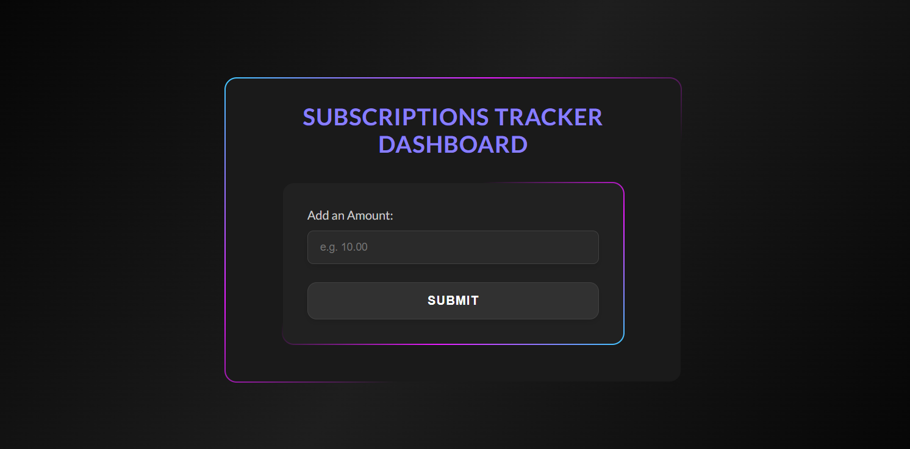
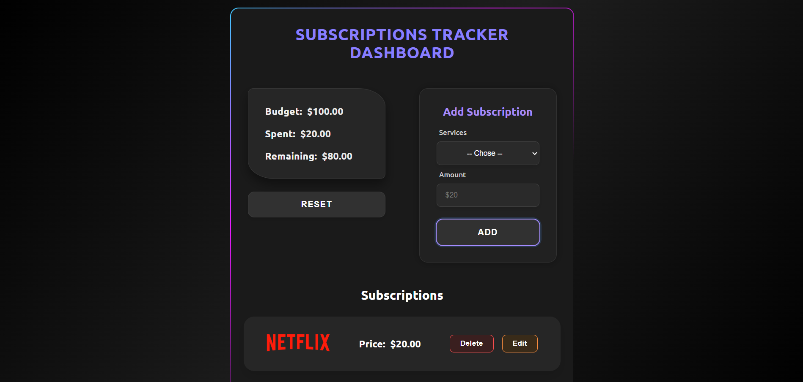

# 📺 Subscription Tracker App

A React-based web app to manage and track your monthly digital subscriptions (like Netflix, Spotify, Disney Plus, etc.) while staying within a predefined budget.

## 🚀 Features

- Add new subscriptions with type and price.
- Edit existing subscriptions.
- Field validation for empty or invalid inputs.
- Automatic budget check before adding or editing a subscription.
- Toast alerts with `sweetalert2` for success and error messages.
- Custom styles and reusable components.

## 🛠️ Tech Stack

- ⚛️ React
- 🎨 CSS Modules
- 🧠 React Hooks (`useState`)
- 📦 SweetAlert2
- 🆔 UUID API (for unique subscription IDs)
- ⚡ Vite

## ✅ Validations

- Shows an error toast if:
  - The subscription type is not selected.
  - The price is empty, zero, or negative.
  - The price exceeds the available budget.
- When editing a subscription, the budget check takes the previous subscription value into account.

## 🔗 Live Demo

You can try the app live on Vercel:
👉 **[]()**

## 📸 Preview




## ▶️ Getting Started

**1. Clone the repository:**

```bash
git clone https://github.com/your-username/subscription-tracker.git

cd subscription-tracker
```

**2. Install dependencies:**

```bash
npm install
```

**3. Run the development server:**

```bash
npm run dev
```

**4. Open `http://localhost:5173` in your browser.**

## 🫱🏾‍🫲🏼 Contributing

**Contributions are welcome!**

**To contribute:**

 - Fork the repository.

- Create a new branch: `git checkout -b feature/your-feature-name`

- Make your changes.

- Commit your changes: `git commit -m "Add your message here"` (with conventional commits)

- Push to your branch: `git push origin feature/your-feature-name`

- Open a Pull Request.

Please make sure your code follows the existing style and naming conventions.
Bug fixes, feature additions, and performance improvements are all welcome 😊.

## 🧑‍💻 Author
Developed by **[Daniel Alejandro Cano Cardona](https://github.com/Dacardonac)**

Inspired by: **[Subscription-Tracker-React | Garu2](https://github.com/garu2/Subscription-Tracker-React)**

